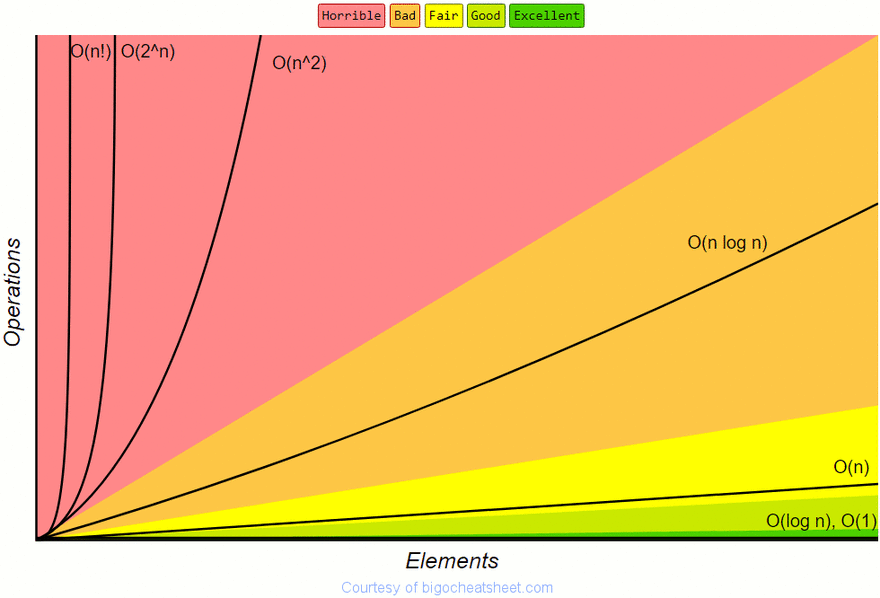

`Bubble Sort` является одним из наиболее широко обсуждаемых алгоритмов, просто из-за недостаточной эффективности сортировки массивов. Если массив уже отсортирован, `Bubble Sort` будет проходить через массив только один раз (с использованием концепции два ниже), однако в худшем случае это время выполнения `O(n²)`, которое крайне неэффективно.

Когда мы рисуем скорость роста `O(n²)`, мы видим, что по сравнению с другими алгоритмами сортировки, такими как сортировка слиянием, то есть `O(n log n)`, он растет гораздо быстрее.



Не смотря на неэффективность `Bubble Sort`, все еще важно понять алгоритм и понять, почему он так плох.

Давайте углубимся в две концепции кодирования `Bubble Sort`.

#### Концепция 1

- Итерация по массиву и проверка каждого элемента по следующему элементу в массиве.
- Если текущий элемент больше, чем следующий элемент, меняйте их местами.
- Если он не больше, переместите указатели вверх и сравните следующие два элемента.
- Как только мы достигаем конца массива, мы знаем, что самый большой элемент находится в последней позиции.
- Повторите этот процесс N раз, где N - длина массива, и каждый раз повторяйте до последнего отсортированного элемента.


Нам нужно иметь два указателя (два вложенных цикла) для концепции один. Каждый раз, когда мы выполняем итерацию, верхняя граница уменьшается на единицу, поскольку мы знаем, что этот индекс содержит отсортированное значение.

```javascript
function bubbleSortConcept1(arr) {
  for (let j = arr.length - 1; j > 0; j--) {
    for (let i = 0; i < j; i++) {
      if (arr[i] > arr[i + 1]) {
        let temp = arr[i];
        arr[i] = arr[i + 1];
        arr[i + 1] = temp;
      }
    }
  }
  
  return arr;
}
```
#### Концепция 2

- Итерация по массиву и проверка каждого элемента по следующему элементу в массиве.
- Если текущий элемент больше, чем следующий элемент, меняйте их местами.
  Укажите, что произошел обмен.
- Если произошел обмен, снова переберите массив.
- Мы знаем, что массив сортируется, когда не произошло никаких перестановок.


Нам нужен только один указатель с этим методом, так как мы используем переменную для хранения логического значения, указывающего, произошел ли обмен. В отличие от первой концепции, эта концепция требует от нас повторения каждого элемента в массиве каждый раз, когда мы проходим через него.

```javascript
function bubbleSortConcept2(arr) {
  let swapped;

  do {
    swapped = false;
    arr.forEach((item, index) => {
      if (item > arr[index + 1]) {
        // Save the value to a variable so we don't lose it
        let temp = item;
        arr[index] = arr[index + 1];
        arr[index + 1] = temp;
        swapped = true;
      }
    })
  } while (swapped);
  
  return arr;
}
```
#### Заключение

`Bubble Sort` - это один из самых неэффективных алгоритмов сортировки. В худшем случае нам придется сравнивать каждый элемент с каждым другим элементом в массиве, следовательно, сложность алгоритма будет `O(n²)`.
